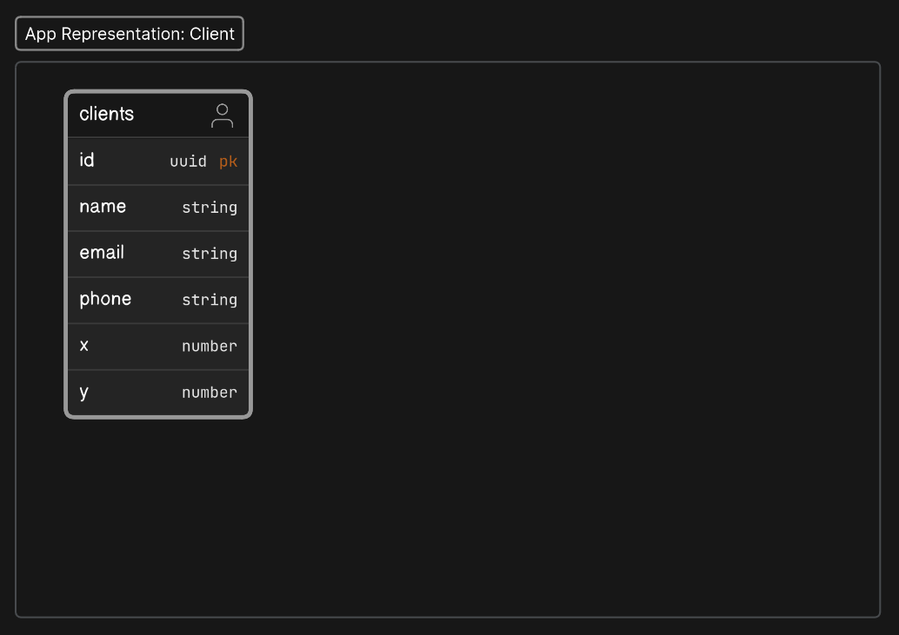

# House Cleaning

An application to management clients and create visit lists.

## Demo

https://house-cleaning.vercel.app/

## About

This application was bootstrapped using the (Next.js 14 Admin Dashboard Template)[https://github.com/vercel/nextjs-postgres-nextauth-tailwindcss-template] that's, by the way, pretty good. I'm using the (Vercel Postgres)[https://vercel.com/docs/storage/vercel-postgres] and also Route Handlers so to run this project locally, the best thing to do is clone it and create a Vercel project. In my opinion, Nextjs projects outside off Vercel are trouble, definetlly a downside since Vercel is expensive for teams but as this projects shows one can quickly create a decent application using it. It's easy to setup Posgres on Vercel, just follow the (Quickstart)[https://vercel.com/docs/storage/vercel-postgres/quickstart].

### Steps to run the project

- Clone this repo: `git clone https://github.com/kauly/house-cleaning.git`
- Install the project dependencies: `pnpm i`
- Create a Vercel project and follow the Quickstart to tie a Postgres database to it.
- Create the `clients` table calling this endpoint: `GET /api/create-clients-table`
- You are done.

## Client Data Model

Shows the following for clients:

- In the API level, in services, and in the UI
- How clients are persisted in the DB
- A system architecture overview

---

## App & Services Representation

This is what the services / API return:



Typescript:

```typescript
export type Client = {
  id: string;
  name: string;
  email: string;
  phone: string;
  x: number;
  y: number;
  distance?: number;
};
```

## DB Representation


> **Note: ** In almost all cases, you should not be directly accessing the DB. Use the our services instead.

---

## Services

Overview of accessing the API from a client app:


